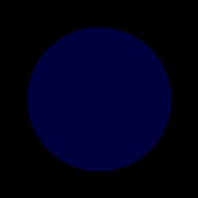
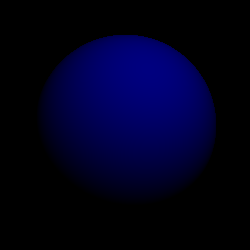
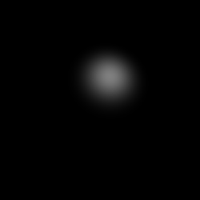
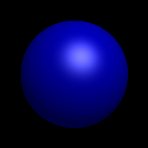
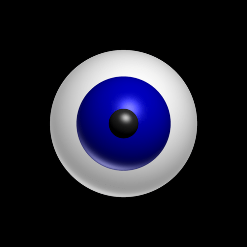
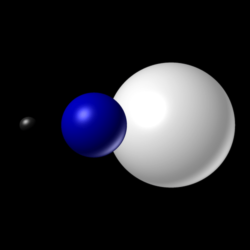

# Ray Tracer

## Objective
The goal of this project is to write a ray-tracer and create computer-generated images.

## About
Ray tracing is a rendering technique for generating an image by tracing the path of light as pixels in an image plane and simulating the effects of its encounters with virtual objects. The technique is capable of producing a very high degree of visual realism, usually higher than that of typical scanline rendering methods, but at a greater computational cost.

http://en.wikipedia.org/wiki/Ray_tracing_(graphics)

### Phong reflection model
The color of each point on a sphere was calculated using the *Phong reflection model*, which uses a combination of the diffuse reflection and the specular reflection of the surface.

#### Ambient + Diffuse + Specular
  
#### Phong Reflection

## Results

## Source
Programming project for the course INF442 (*Traitement des données massives*) at École Polytechnique.
